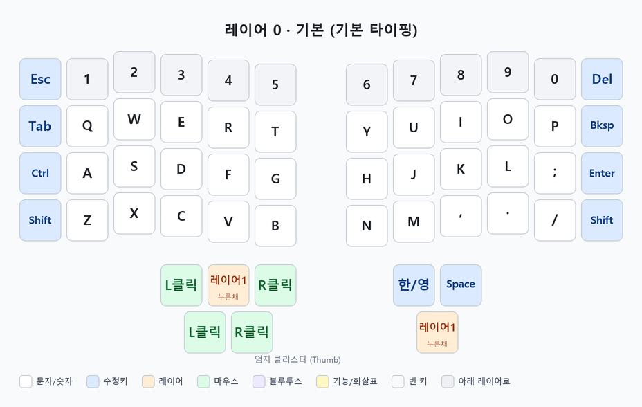
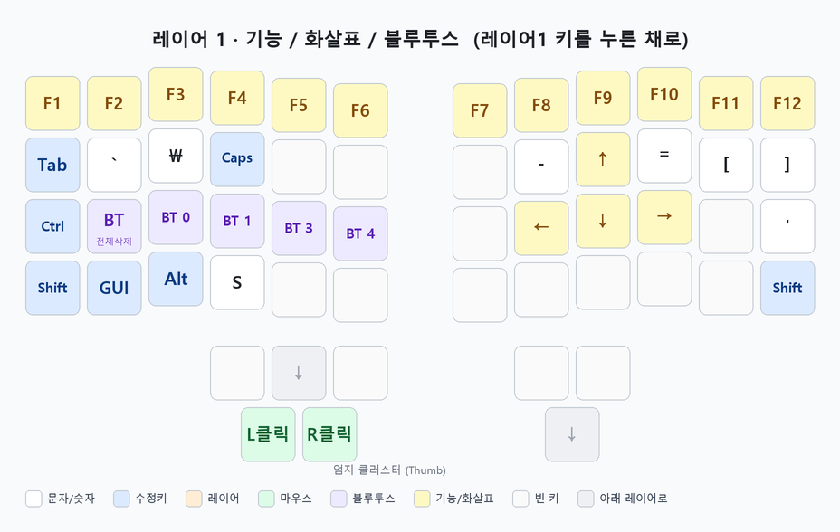

# V&Z-Charybdis (4x6) 사용설명서

무선 스플릿(좌우 분리형) 키보드 + **트랙볼** + **스크롤 노브 2개**가 달린 키보드입니다.
펌웨어는 **ZMK**를 사용하며, 컨트롤러는 각 손마다 **nice!nano v2** 보드가 들어 있습니다.

> 이 문서는 처음 쓰는 분도 따라 할 수 있도록 만든 사용설명서입니다. 순서대로 읽어보세요.

---

## 1. 기본 구성

| 항목 | 내용 |
|------|------|
| 형태 | 스플릿(왼손/오른손 따로) |
| 오른손 | **트랙볼**(마우스 커서 역할) |
| 왼손 | **스크롤 노브 2개**(세로 스크롤 / 가로 스크롤) |
| 연결 | **블루투스(무선)** + USB-C(유선/충전) |
| 전원 | 각 손마다 전원 스위치 + 내장 배터리 |
| 블루투스 표시 이름 | **`V&Z-Charydbis`** |

---

## 2. 켜기 · 끄기 · 충전

- 각 손 보드 옆의 **전원 스위치**로 켜고 끕니다. **양쪽 다 켜야** 정상 동작합니다.
- 충전은 **USB-C 케이블**을 각 손에 꽂아서 합니다. (양쪽 배터리는 따로이므로 둘 다 충전)
- 오래 안 쓰면 자동으로 절전(슬립)되고, 키를 누르면 깨어납니다.

---

## 3. 블루투스 연결하기

이 키보드는 **여러 개의 기기(프로파일)**를 기억할 수 있어요.

1. 왼손 엄지의 **`레이어1`** 키를 **누른 채로**, 원하는 프로파일 번호 **`BT 0` / `BT 1` / `BT 3` / `BT 4`** 중 하나를 누릅니다. (프로파일 위치는 아래 [레이어 1](#레이어-1--기능--화살표--블루투스) 그림 참고)
2. 폰/PC의 블루투스 목록에서 **`V&Z-Charydbis`** 를 찾아 연결합니다.
3. 다른 기기에 연결하려면 다른 번호(`BT 1` 등)를 고른 뒤 2번을 반복하세요.

> **연결이 꼬였을 때**: `레이어1`을 누른 채 **`BT 전체삭제`**(왼손 그림의 보라색 BT 키)를 누르면 저장된 블루투스 정보가 모두 지워집니다. 그다음 폰에서도 이 키보드를 "삭제/등록 해제" 후 다시 페어링하세요.

---

## 4. 레이어(Layer)란?

키보드에 키가 **여러 층**으로 겹쳐 있다고 생각하면 됩니다.

- 평소에는 **레이어 0(기본)** 상태입니다.
- 엄지의 **`레이어1`** 키를 **누르고 있는 동안**만 **레이어 1**(기능키·화살표·블루투스)로 바뀝니다. 손을 떼면 다시 기본으로 돌아옵니다.

### 레이어 0 · 기본 (평소 타이핑)

### 레이어 1 · 기능 / 화살표 / 블루투스

**왼손 엄지의 `레이어1` 키를 누른 채로** 사용하는 층입니다. F1~F12, 방향키(↑↓←→), 블루투스 선택 등이 있습니다.

> 그림 아래쪽 **범례(색깔 설명)**를 참고하면 각 키 종류를 쉽게 알 수 있어요.
> (참고: 왼손 `\` 자리는 한글 글꼴에서 원화 기호 `₩`로 보이지만, 실제로는 역슬래시 `\` 키입니다.)

---

## 5. 트랙볼 & 스크롤 노브

- **오른손 트랙볼**: 굴리면 **마우스 커서**가 움직입니다. 클릭은 엄지의 **`L클릭`(왼쪽) / `R클릭`(오른쪽)** 키로 합니다.
- **왼손 노브 2개**: 돌리면 **스크롤**됩니다. 하나는 **세로 스크롤**, 하나는 **가로 스크롤**입니다.

---

## 6. 키 배치 바꾸기 — 가장 쉬운 방법 (ZMK Studio, 펌웨어 굽기 불필요) ⭐

이 키보드는 **ZMK Studio**를 지원해서, **복잡한 과정 없이 브라우저에서 실시간으로 키를 바꿀 수 있습니다.**

1. **오른손** 보드를 USB-C 케이블로 컴퓨터에 연결합니다.
2. 크롬(Chrome) 또는 엣지(Edge) 브라우저로 **<https://zmk.studio>** 에 접속합니다.
3. **Connect** → USB 장치를 선택하면 현재 키맵이 화면에 뜹니다.
4. 바꾸고 싶은 키를 클릭해서 새 키를 지정하고 저장하면 **바로 적용**됩니다.

> 대부분의 "키 하나만 바꾸고 싶다" 같은 경우는 이 방법이면 충분하고, 아래 7번(펌웨어 굽기)은 할 필요가 없습니다.

---

## 7. 펌웨어 다시 굽기 (필요할 때만 · 고급)

ZMK Studio로 안 되는 큰 변경이나, 펌웨어를 복구할 때만 사용합니다.

**굽는 방법(각 손 공통):**
1. 해당 손 보드를 USB-C로 컴퓨터에 연결합니다.
2. 보드의 **리셋 버튼을 빠르게 두 번(더블클릭)** 누릅니다. → 컴퓨터에 **`NICENANO`** 라는 USB 드라이브가 나타납니다.
3. 펌웨어 파일 **`.uf2`** 를 그 드라이브에 **드래그해서 복사**합니다.
4. 복사가 끝나면 **자동으로 재부팅**되며 완료됩니다.
5. 반대쪽 손도 필요하면 같은 방법으로 진행합니다.

**펌웨어 파일(.uf2)은 어디서?**
- 이 저장소의 **[Actions 탭](../../actions)** 에서 최신 빌드 결과물(Artifacts)을 내려받습니다. *(내려받으려면 무료 GitHub 로그인이 필요합니다.)*
- 파일이 두 종류입니다: **`charybdis_left`(왼손용)**, **`charybdis_right`(오른손용)**.

> ⚠️ **주의**: 왼손 펌웨어는 왼손에, 오른손 펌웨어는 오른손에만 구우세요. **좌우를 바꿔 구우면 안 됩니다.**
> 또, 초기화용 **`settings_reset`** 펌웨어를 구우면 저장된 블루투스 연결이 모두 지워집니다(중고 양도 시 유용).

---

## 8. 자주 묻는 문제 (FAQ)

| 증상 | 해결 |
|------|------|
| 한쪽 손이 입력이 안 됨 | 양쪽 다 **전원 켜짐** 확인 → 배터리 충전 → 각 보드 리셋 1회 |
| 블루투스 연결이 안 됨 | `레이어1`+`BT 전체삭제` 로 초기화 → 폰에서도 기기 삭제 → 다시 페어링 |
| 트랙볼이 안 움직임 | **오른손** 전원/배터리/연결 확인 |
| 노브 스크롤이 이상함 | 반대 방향 노브인지 확인(세로/가로), 재연결 |
| 키가 겹쳐 이상하게 눌림 | `레이어1` 키가 눌린 채 고정됐는지 확인 후 재부팅 |

---

## 9. 개발자용 정보

- 키맵 파일: [`config/charybdis.keymap`](config/charybdis.keymap)
- 설정 파일: [`config/charybdis.conf`](config/charybdis.conf), [`config/boards/shields/charybdis/`](config/boards/shields/charybdis/)
- 빌드: GitHub Actions([`.github/workflows/build.yml`](.github/workflows/build.yml))가 push마다 좌/우/초기화 펌웨어를 자동 빌드
- 트랙볼 드라이버: [DoctorWangWang/zmk-pmw3610-driver](https://github.com/DoctorWangWang/zmk-pmw3610-driver)

### 참고 링크
- **ZMK Studio (키맵 실시간 편집)**: <https://zmk.studio>
- **키맵 에디터(저장소 직접 편집)**: <https://nickcoutsos.github.io/keymap-editor/>
- **ZMK 공식 문서**: <https://zmk.dev/docs>
- **이 저장소**: <https://github.com/ddung2ina-lab/ddungs-zmk>
